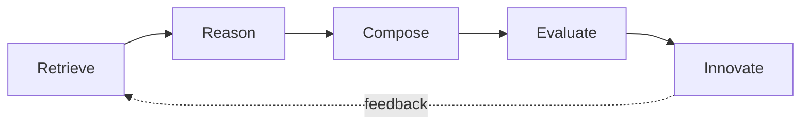

<div align="center">


# 🥧 APIE — AI-Produktinnovations-Engine

**Die offene Wissensdatenbank für KI-Produktinnovation.**

Lernen Sie von den größten Produkten der Welt. Bauen Sie das nächste.

**🌐 [English](README.md) · [中文](README.zh-CN.md) · [Français](README.fr.md)**

[](LICENSE)
[](.github/workflows/ci.yml)
[](https://github.com/iwanhk/APIE)

</div>

---

> **Jedes großartige Produkt beginnt mit einem A PIE (einem Kuchenstück).**

APIE lehrt KI, **wie großartige Produkte gebaut werden** — nicht, wie man ein PRD schreibt. Es ist eine offene, maschinenlesbare Wissensdatenbank, die dokumentiert, *warum* Apple, Cursor, ChatGPT, TikTok und Robinhood erfolgreich waren — und diese Gründe dann zu Produkten der nächsten Generation kombiniert.

## Die Kernphilosophie

> Große Produkte werden selten aus dem Nichts erfunden. Sie entstehen, indem man großartige Muster entdeckt, großartige Ideen kombiniert und echte Nutzerprobleme löst.

APIE existiert, weil das meiste „KI-Produktwissen" in einigen Essays und hinter Bezahlschranken steckt. Wir machen dieses Wissen in einem Format quelloffen, das **Menschen und KI-Agenten direkt indexieren können**:

- **Jedes Produkt** ist eine Markdown-Datei mit einem einheitlichen Schema.
- **Jedes Muster** ist eine Markdown-Datei mit einem einheitlichen Schema.
- **Alles** wird in JSON-Datensätze kompiliert, die programmatisch nutzbar sind.
- **Cross-Domain-Transfer** (der Teil, den sonst niemand baut) verwandelt Muster aus einer Branche in Innovationen einer anderen.

## Warum das keine „weitere Awesome List" ist

[Awesome-LLM](https://github.com/Hannibal046/Awesome-LLM) und ähnliche Repos sind kuratierte **Link-Verzeichnisse**. Sie beantworten: *„Wo kann ich über X lesen?"*

APIE ist eine **strukturierte Wissensdatenbank**. Sie beantwortet:

*„Angesichts des Musters, das die Empfehlungsschleife von Netflix zum Funktionieren brachte: Was sollte ein Investmentprodukt morgen tun?"*

Genau deshalb ist APIE ein **offener Standard**, keine Sammlung:

| Standard | Datei |
| --- | --- |
| APIE Product Schema v1 | [docs/APIE-Product-Schema-v1.md](docs/APIE-Product-Schema-v1.md) |
| APIE Pattern Schema v1 | [docs/APIE-Pattern-Schema-v1.md](docs/APIE-Pattern-Schema-v1.md) |
| APIE Feature Schema v1 | [docs/APIE-Feature-Schema-v1.md](docs/APIE-Feature-Schema-v1.md) |
| APIE Cross-Domain Schema v1 | [docs/APIE-CrossDomain-Schema-v1.md](docs/APIE-CrossDomain-Schema-v1.md) |
| APIE Skill Specification v1 | [docs/APIE-Skill-Specification-v1.md](docs/APIE-Skill-Specification-v1.md) |

Jeder kann eine Produktanalyse, ein Designmuster oder einen Innovationsfall einreichen. Wenn es dem Schema folgt, wird es automatisch indexiert und wiederverwendbar.

## Aktueller Inhalt

| Bibliothek | Anzahl | Verzeichnis |
| --- | --- | --- |
| Produkt-Teardowns | 3 (Cursor, Lovable, Robinhood) | [products/](products/README.md) |
| Muster | 5 | [patterns/](patterns/README.md) |
| Funktionen | 6 | [features/](features/README.md) |
| UX-Flows | 4 | [ux-flows/](ux-flows/README.md) |
| Cross-Domain-Transfers | 1 | [cross-domain/](cross-domain/README.md) |
| Geschäftsmodelle | 1 | [business-models/](business-models/README.md) |
| JSON-Datensätze | 7 | [datasets/](datasets/README.md) |

## Repo-Struktur

```text
APIE/
├── README.md               # Sie sind hier
├── LICENSE                 # MIT — alles ist offen
├── CONTRIBUTING.md         # So tragen Sie Wissen bei
├── ROADMAP.md              # Wohin das Projekt geht
├── CHANGELOG.md            # Was sich geändert hat
├── PRODUCTS.md             # Produktindex
├── PATTERNS.md             # Musterindex
├── SKILLS.md               # Skill-Index
├── docs/                   # Schemata, tägliche Pipeline, Berichte, Launch-Kit
├── datasets/               # maschinenlesbares JSON (automatisch erstellt)
├── products/               # Produkt-Teardowns, eine Datei pro Produkt
├── patterns/               # die Musterbibliothek — das Herzstück
├── features/               # Wissen auf Funktionsebene
├── business-models/        # Preis- und Geschäftsmodelle
├── ux-flows/               # kombinierbare UX-Flows
├── cross-domain/           # Musterübertragungen zwischen Branchen
├── innovation-engine/      # das APIE-Gehirn: Retrieve → … → Innovate
├── prompts/                # einsatzbereite Prompts
├── skills/                 # strukturierte Skills (nicht nur Prompts)
├── examples/               # ausgearbeitete Innovations-Challenges
├── tools/                  # geplante Tools & MCP-Integration
├── scripts/                # Pipeline- und Daten-Skripte
├── community/              # So können Sie mitmachen und mitbestimmen
└── assets/                 # Logo und Medien
```

## Das APIE-Gehirn

Das gesamte Repository speist eine einzige Reasoning-Engine. Nichts wird aus dem Nichts generiert — alles wird **abgerufen, durchdacht, kombiniert und bewertet**.



1. **Retrieve** — Produkte, Muster, Funktionen, Flows und Cross-Domain-Links aus `datasets/*.json` abrufen.
2. **Reason** — das Problem zerlegen und auf bekannte Muster abbilden.
3. **Compose** — Muster über Domänen hinweg kombinieren (z. B. Netflix × Robinhood).
4. **Evaluate** — Ideen nach Nutzwert, Machbarkeit, Burggraben, Timing und Risiko bewerten.
5. **Innovate** — Produktkonzepte mit vollständiger Herkunft (Provenance) ausgeben.

Vollständige Beschreibung: [innovation-engine/README.md](innovation-engine/README.md)

## Tägliche Produkt-Intelligence-Pipeline

APIE wächst jeden Tag. Die tägliche Pipeline produziert fünf Arten von Inhalten:

| # | Ergebnis | Ablageort |
| --- | --- | --- |
| 1 | **Neue Produkte** — Product Hunt, YC, GitHub Trending, Hacker News, KI-Rankings | `products/` + `datasets/raw/` |
| 2 | **Muster-Mining** — neue Muster aus den gestrigen Launches | `patterns/` |
| 3 | **Reverse Engineering** — ein Teardown pro Tag (Tag 001 = Cursor, Tag 002 = Lovable…) | `products/` |
| 4 | **Innovations-Challenge** — zwei Zufallsprodukte, 20 generierte Innovationen | `examples/` |
| 5 | **Wöchentlicher Musterbericht** — Synthese der letzten 7 Tage | `docs/reports/` |

Die Automatisierung läuft täglich um 02:00 UTC (= 10:00 Shanghai-Zeit). Siehe [docs/DAILY-PIPELINE.md](docs/DAILY-PIPELINE.md) und [docs/DAILY-TASK.md](docs/DAILY-TASK.md).

## Erste Schritte

**Für Menschen:** Beginnen Sie mit dem Teardown von [Cursor](products/AI/Cursor.md), dann der [Musterbibliothek](patterns/README.md), dann einem [Cross-Domain-Transfer](cross-domain/README.md).

**Für KI-Agenten:** Lesen Sie `docs/SCHEMAS.md`, laden Sie `datasets/*.json` und folgen Sie dem Gehirn-Protokoll in `innovation-engine/README.md`. Die Schemata garantieren, dass der Inhalt konsistent genug ist, um ohne Bereinigung indexiert zu werden.

**Zum Mitwirken:** Siehe [CONTRIBUTING.md](CONTRIBUTING.md). Jede Datei folgt einem Schema und jede Tatsache trägt eine Quelle und ein „Stand"-Datum.

**Launch-Kit** (Projektgeschichte, Show-HN-/Product-Hunt-/X-Entwürfe, tägliche Content-Vorlagen): [docs/launch](docs/launch/)

## Status

**v0.1 — Öffentliche Veröffentlichung.** Fünf offene Standards v1; 3 Produkt-Teardowns; 5 Muster; 6 Funktionen; 4 UX-Flows; Cross-Domain-Transfers; funktionierender Dataset-Builder + CI + tägliche Pipeline-Automatisierung. Bei jedem Push neu erstellt und validiert. Siehe [ROADMAP.md](ROADMAP.md).

## Lizenz

MIT — [LICENSE](LICENSE). Wissen will kombiniert werden.

---

<div align="center">

**🥧 Jedes großartige Produkt beginnt mit einem A PIE.**

Wenn APIE Ihnen geholfen hat, [hinterlassen Sie einen Stern](https://github.com/iwanhk/APIE) ⭐

</div>
