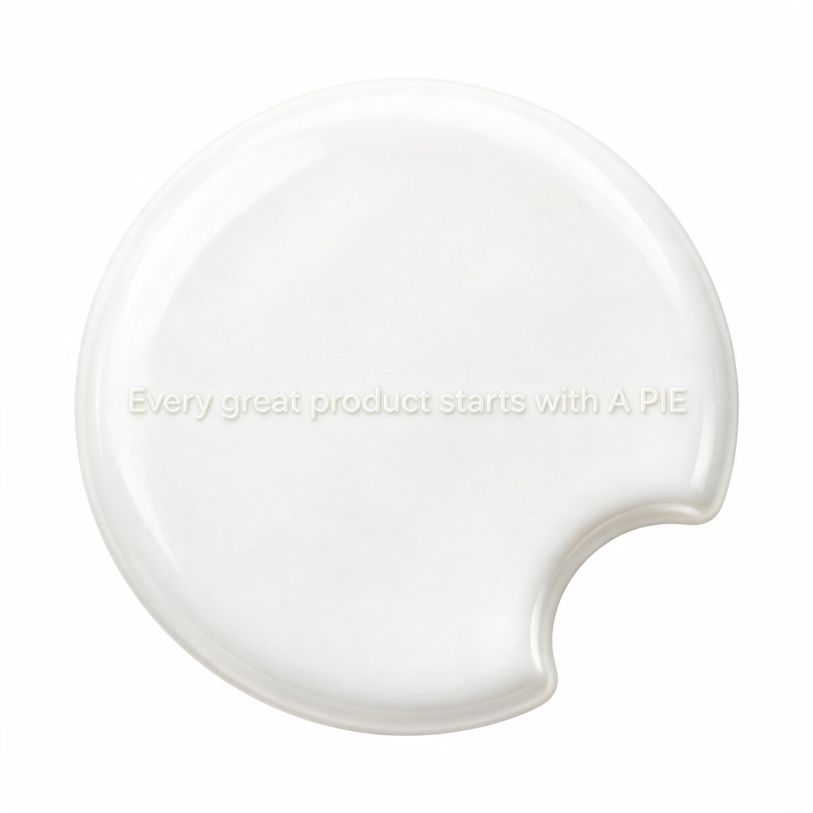
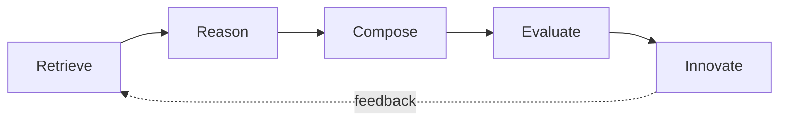

<div align="center">



# 🥧 APIE — Moteur d'innovation produit IA

**La base de connaissances ouverte de l'innovation produit pour l'IA.**

Apprenez des plus grands produits du monde. Construisez le suivant.

**🌐 [English](README.md) · [中文](README.zh-CN.md) · [Deutsch](README.de.md)**

[](LICENSE)
[](.github/workflows/ci.yml)
[](https://github.com/iwanhk/APIE)

</div>

---

> **Chaque grand produit commence par une PIE (une part).**

APIE apprend à l'IA **comment les grands produits sont construits** — pas comment écrire un PRD. C'est une base de connaissances ouverte et lisible par machine qui documente *pourquoi* Apple, Cursor, ChatGPT, TikTok et Robinhood ont réussi — puis combine ces raisons pour concevoir la prochaine génération de produits.

## La philosophie centrale

> Les grands produits sont rarement inventés de toutes pièces. Ils sont construits en découvrant de grands patterns, en combinant de grandes idées et en résolvant de vrais problèmes d'utilisateurs.

APIE existe parce que la plupart des connaissances sur les « produits IA » sont enfermées dans quelques essais et des analyses payantes. Nous open-sourceons ce savoir dans un format que **les humains comme les agents IA peuvent indexer directement** :

- **Chaque produit** est un fichier Markdown avec un schéma unifié.
- **Chaque pattern** est un fichier Markdown avec un schéma unifié.
- **Tout** est compilé en jeux de données JSON, utilisables par programmation.
- **Le transfert inter-domaines** (la partie que personne d'autre ne construit) transforme les patterns d'un secteur en innovations d'un autre.

## Pourquoi ce n'est pas « une énième Awesome List »

[Awesome-LLM](https://github.com/Hannibal046/Awesome-LLM) et les dépôts similaires sont des **annuaires de liens** organisés. Ils répondent : *« où puis-je lire sur X ? »*

APIE est une **base de connaissances structurée**. Elle répond :

*« Étant donné le pattern qui a fait fonctionner la boucle de recommandation de Netflix, que devrait faire un produit d'investissement demain ? »*

C'est pour cela qu'APIE est une **norme ouverte**, pas une collection :

| Norme | Fichier |
| --- | --- |
| APIE Product Schema v1 | [docs/APIE-Product-Schema-v1.md](docs/APIE-Product-Schema-v1.md) |
| APIE Pattern Schema v1 | [docs/APIE-Pattern-Schema-v1.md](docs/APIE-Pattern-Schema-v1.md) |
| APIE Feature Schema v1 | [docs/APIE-Feature-Schema-v1.md](docs/APIE-Feature-Schema-v1.md) |
| APIE Cross-Domain Schema v1 | [docs/APIE-CrossDomain-Schema-v1.md](docs/APIE-CrossDomain-Schema-v1.md) |
| APIE Skill Specification v1 | [docs/APIE-Skill-Specification-v1.md](docs/APIE-Skill-Specification-v1.md) |

Tout le monde peut soumettre une analyse de produit, un pattern de conception ou un cas d'innovation. S'il respecte le schéma, il est automatiquement indexé et réutilisable.

## Contenu actuel

| Bibliothèque | Nombre | Répertoire |
| --- | --- | --- |
| Teardowns de produits | 3 (Cursor, Lovable, Robinhood) | [products/](products/README.md) |
| Patterns | 5 | [patterns/](patterns/README.md) |
| Fonctionnalités | 6 | [features/](features/README.md) |
| Parcours UX | 4 | [ux-flows/](ux-flows/README.md) |
| Transferts inter-domaines | 1 | [cross-domain/](cross-domain/README.md) |
| Modèles d'affaires | 1 | [business-models/](business-models/README.md) |
| Jeux de données JSON | 7 | [datasets/](datasets/README.md) |

## Structure du dépôt

```text
APIE/
├── README.md               # vous êtes ici
├── LICENSE                 # MIT — tout est ouvert
├── CONTRIBUTING.md         # comment contribuer
├── ROADMAP.md              # où nous allons
├── CHANGELOG.md            # ce qui a changé
├── PRODUCTS.md             # index des produits
├── PATTERNS.md             # index des patterns
├── SKILLS.md               # index des skills
├── docs/                   # schémas, pipeline quotidien, rapports, kit de lancement
├── datasets/               # JSON lisible par machine (généré automatiquement)
├── products/               # teardowns de produits, un fichier par produit
├── patterns/               # la bibliothèque de patterns — cœur du projet
├── features/               # connaissances au niveau fonctionnalité
├── business-models/        # modèles de prix et d'affaires
├── ux-flows/               # parcours UX composables
├── cross-domain/           # transferts de patterns entre secteurs
├── innovation-engine/      # le cerveau APIE : Retrieve → … → Innovate
├── prompts/                # prompts prêts à l'emploi
├── skills/                 # skills structurés (pas seulement des prompts)
├── examples/               # défis d'innovation aboutis
├── tools/                  # outils planifiés et intégration MCP
├── scripts/                # scripts du pipeline et des données
├── community/              # comment rejoindre et gouverner
└── assets/                 # logo et médias
```

## Le cerveau APIE

Tout le dépôt est conçu pour alimenter un unique moteur de raisonnement. Rien n'est généré à partir de rien — tout est **récupéré, raisonné, composé et évalué**.



1. **Retrieve** — récupérer produits, patterns, fonctionnalités, parcours et liens inter-domaines depuis `datasets/*.json`.
2. **Reason** — décomposer le problème et le mapper sur les patterns connus.
3. **Compose** — combiner les patterns entre domaines (ex. Netflix × Robinhood).
4. **Evaluate** — noter les idées sur la valeur utilisateur, la faisabilité, la moat, le timing et le risque.
5. **Innovate** — émettre des concepts produits avec provenance complète.

Description complète : [innovation-engine/README.md](innovation-engine/README.md)

## Pipeline quotidien d'intelligence produit

APIE grandit chaque jour. Le pipeline quotidien produit cinq types de contenu :

| # | Production | Destination |
| --- | --- | --- |
| 1 | **Nouveaux produits** — Product Hunt, YC, GitHub Trending, Hacker News, classements IA | `products/` + `datasets/raw/` |
| 2 | **Mining de patterns** — nouveaux patterns observés dans les lancements de la veille | `patterns/` |
| 3 | **Ingénierie inverse** — un teardown approfondi par jour (Jour 001 = Cursor, Jour 002 = Lovable…) | `products/` |
| 4 | **Défi d'innovation** — deux produits au hasard, 20 innovations générées | `examples/` |
| 5 | **Rapport hebdomadaire de patterns** — synthèse des 7 derniers jours | `docs/reports/` |

L'automatisation tourne chaque jour à 02:00 UTC (= 10:00 heure de Shanghai). Voir [docs/DAILY-PIPELINE.md](docs/DAILY-PIPELINE.md) et [docs/DAILY-TASK.md](docs/DAILY-TASK.md).

## Pour commencer

**Pour les humains :** commencez par le teardown de [Cursor](products/AI/Cursor.md), puis la [bibliothèque de patterns](patterns/README.md), puis un [transfert inter-domaines](cross-domain/README.md).

**Pour les agents IA :** lisez `docs/SCHEMAS.md`, chargez `datasets/*.json`, et suivez le protocole Brain dans `innovation-engine/README.md`. Les schémas garantissent un contenu suffisamment cohérent pour être indexé sans nettoyage.

**Pour contribuer :** voir [CONTRIBUTING.md](CONTRIBUTING.md). Chaque fichier suit un schéma et chaque fait porte une source et une date « au  » (as of).

**Kit de lancement** (histoire du dépôt, brouillons Show HN / Product Hunt / X, modèles de contenu quotidien) : [docs/launch](docs/launch/)

## Statut

**v0.1 — Lancement public.** Cinq normes ouvertes v1 ; 3 teardowns de produits ; 5 patterns ; 6 fonctionnalités ; 4 parcours UX ; transferts inter-domaines ; générateur de datasets + CI + automatisation du pipeline quotidien. Reconstruit et validé à chaque push. Voir [ROADMAP.md](ROADMAP.md).

## Licence

MIT — [LICENSE](LICENSE). Le savoir veut être combiné.

---

<div align="center">

**🥧 Chaque grand produit commence par une PIE.**

Si APIE vous a aidé à réfléchir, [laissez une étoile](https://github.com/iwanhk/APIE) ⭐

</div>
