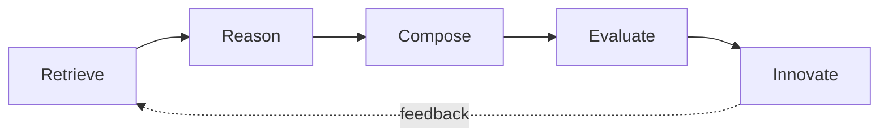

<div align="center">


[](LICENSE)
[](.github/workflows/ci.yml)

# 🥧 APIE — AI Product Innovation Engine

**The Open Product Innovation Knowledge Base for AI.**

Learn from the world's greatest products. Build the next one.

</div>

---

> **Every great product starts with A PIE.**

APIE teaches AI **how great products are built** — not how to write a PRD.

It is an open, machine-readable knowledge base that documents *why* Apple, Cursor, ChatGPT, TikTok, and Robinhood succeeded — then combines those reasons into the next generation of products.

---

## The Core Philosophy

> Great products are rarely invented from nothing. They are built by discovering great patterns, combining great ideas, and solving real user problems.

APIE exists because most "AI product" knowledge is locked inside a handful of essays and paywalled analyses. We are open-sourcing that knowledge in a format both **humans and AI agents can index directly**:

- **Every product** is one Markdown file with a unified schema.
- **Every pattern** is one Markdown file with a unified schema.
- **Everything** is compiled into JSON datasets for programmatic use.
- **Cross-domain transfer** (the part no one else builds) turns patterns from one industry into innovations in another.

## Why This Is Not "Another Awesome List"

[Awesome-LLM](https://github.com/Hannibal046/Awesome-LLM) and similar repos are curated **link directories**. They answer: *"where can I read about X?"*

APIE is a **structured knowledge base**. It answers:

*"Given the pattern that made Netflix's recommendation loop work, what should an investment product do tomorrow?"*

That difference is why APIE is an **open standard**, not a collection:

| Standard | File |
| --- | --- |
| APIE Product Schema v1 | [docs/APIE-Product-Schema-v1.md](docs/APIE-Product-Schema-v1.md) |
| APIE Pattern Schema v1 | [docs/APIE-Pattern-Schema-v1.md](docs/APIE-Pattern-Schema-v1.md) |
| APIE Feature Schema v1 | [docs/APIE-Feature-Schema-v1.md](docs/APIE-Feature-Schema-v1.md) |
| APIE Cross-Domain Schema v1 | [docs/APIE-CrossDomain-Schema-v1.md](docs/APIE-CrossDomain-Schema-v1.md) |
| APIE Skill Specification v1 | [docs/APIE-Skill-Specification-v1.md](docs/APIE-Skill-Specification-v1.md) |

Anyone can submit a product analysis, a design pattern, or an innovation case. If it follows the schema, it is automatically indexed and reusable.

## Repository Layout

```text
APIE/
├── README.md               # you are here
├── LICENSE                 # MIT — everything is open
├── CONTRIBUTING.md         # how to add knowledge
├── ROADMAP.md              # where this is going
├── CHANGELOG.md            # what changed
├── PRODUCTS.md             # product index
├── PATTERNS.md             # pattern index
├── SKILLS.md               # skill index
├── docs/                   # schemas, daily pipeline, reports
├── datasets/               # machine-readable JSON (auto-built)
├── products/               # product teardowns, one file per product
├── patterns/               # the pattern library — project core
├── features/               # feature-level knowledge
├── business-models/        # pricing & business model patterns
├── ux-flows/               # composable UX flows
├── cross-domain/           # pattern transfers across industries
├── innovation-engine/      # the APIE Brain: Retrieve → … → Innovate
├── prompts/                # ready-to-use prompts
├── skills/                 # structured skills (not just prompts)
├── examples/               # worked innovation challenges
├── tools/                  # planned tooling & MCP integration
├── scripts/                # pipeline & dataset scripts
├── community/              # how to join and govern
└── assets/                 # logo and media
```

## The APIE Brain

The whole repository is designed to feed a single reasoning engine. Nothing is generated from nothing — everything is **retrieved, reasoned over, composed, and evaluated**.



1. **Retrieve** — pull products, patterns, features, flows, and cross-domain links from `datasets/*.json`.
2. **Reason** — decompose the problem and map it onto known patterns.
3. **Compose** — combine patterns across domains (e.g., Netflix × Robinhood).
4. **Evaluate** — score ideas on user value, feasibility, moat, timing, and risk.
5. **Innovate** — emit product concepts with full provenance back to sources.

Full description: [innovation-engine/README.md](innovation-engine/README.md)

## Daily Product Intelligence Pipeline

APIE grows every day. The daily pipeline produces five kinds of content:

| # | Output | Where it lands |
| --- | --- | --- |
| 1 | **New Products** — watch Product Hunt, YC, GitHub Trending, Hacker News, AI leaderboards | `products/` + `datasets/raw/` |
| 2 | **Pattern Mining** — new patterns observed in yesterday's launches | `patterns/` |
| 3 | **Reverse Engineering** — one deep teardown per day (Day 001 = Cursor, Day 002 = Lovable…) | `products/` |
| 4 | **Innovation Challenge** — two random products, 20 generated innovations | `examples/` |
| 5 | **Weekly Pattern Report** — weekly synthesis of the last 7 days | `docs/reports/` |

See [docs/DAILY-PIPELINE.md](docs/DAILY-PIPELINE.md) for the full workflow, automation options, and quality gates.

## Getting Started

**For humans:** start with the teardown of [Cursor](products/AI/Cursor.md), then the [pattern library](patterns/README.md), then a [cross-domain transfer](cross-domain/README.md).

**For AI agents:** read `docs/SCHEMAS.md`, load `datasets/*.json`, and follow the Brain protocol in `innovation-engine/README.md`. The schemas guarantee the content is consistent enough to be indexed without cleaning.

**To contribute:** see [CONTRIBUTING.md](CONTRIBUTING.md). Every file follows a schema and every fact carries a source and an "as of" date.

## Status

**v0.1 — Public release.** Five open standards v1; 3 product teardowns (Cursor, Lovable, Robinhood); 5 patterns; 6 features; 4 UX flows; cross-domain transfers; working dataset builder + daily pipeline automation. Rebuilt and validated by CI on every push. See [ROADMAP.md](ROADMAP.md).

## Launch Kit

Repository, launch copy, and daily content templates: [docs/launch](docs/launch/).

## License

MIT — [LICENSE](LICENSE). Knowledge wants to be combined.
