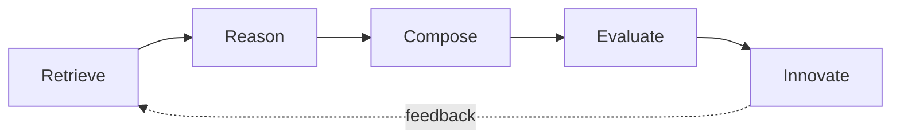

<div align="center">


# 🥧 APIE — AI 产品创新引擎

**面向 AI 的开放产品创新知识库。**

向全球最伟大的产品学习，打造下一个。

**🌐 [English](README.md) · [Français](README.fr.md) · [Deutsch](README.de.md)**

[](LICENSE)
[](.github/workflows/ci.yml)
[](https://github.com/iwanhk/APIE)

</div>

---

> **每个伟大的产品都始于一个 PIE（馅饼）。**

APIE 教会 AI **理解伟大的产品是如何被创造出来的**——不是教它写 PRD。它是一个开放、机器可读的知识库，记录 Apple、Cursor、ChatGPT、TikTok、Robinhood 为什么成功，然后把原因组合成下一代产品。

## 核心哲学

> 伟大的产品很少凭空诞生。它们来自发现伟大的模式（Patterns）、组合伟大的想法（Ideas）、解决真实用户问题（Problems）。

APIE 存在的原因：大部分"AI 产品"知识被锁在少数文章和付费分析里。我们把知识以**人类和 AI 都能直接索引**的格式开源：

- **每个产品** 都是一个统一 Schema 的 Markdown 文件
- **每个模式** 都是一个统一 Schema 的 Markdown 文件
- **所有内容** 都编译成 JSON 数据集，可编程使用
- **跨领域迁移**（没人做的部分）把一个行业的模式变成另一个行业的创新

## 为什么这不是"又一个 Awesome 列表"

[Awesome-LLM](https://github.com/Hannibal046/Awesome-LLM) 这类仓库是精选的**链接目录**，回答"去哪里读 X"。

APIE 是**结构化知识库**，回答：

*"既然 Netflix 推荐循环的模式成立了，投资产品明天应该怎么做？"*

这就是 APIE 是**开放标准**而不是收藏集的原因：

| 标准 | 文件 |
| --- | --- |
| APIE Product Schema v1 | [docs/APIE-Product-Schema-v1.md](docs/APIE-Product-Schema-v1.md) |
| APIE Pattern Schema v1 | [docs/APIE-Pattern-Schema-v1.md](docs/APIE-Pattern-Schema-v1.md) |
| APIE Feature Schema v1 | [docs/APIE-Feature-Schema-v1.md](docs/APIE-Feature-Schema-v1.md) |
| APIE Cross-Domain Schema v1 | [docs/APIE-CrossDomain-Schema-v1.md](docs/APIE-CrossDomain-Schema-v1.md) |
| APIE Skill Specification v1 | [docs/APIE-Skill-Specification-v1.md](docs/APIE-Skill-Specification-v1.md) |

任何人都可以提交产品分析、设计模式或创新案例。只要符合 Schema，就会被自动索引和复用。

## 目前内容

| 库 | 数量 | 目录 |
| --- | --- | --- |
| 产品拆解 | 3（Cursor、Lovable、Robinhood） | [products/](products/README.md) |
| 模式 | 5 | [patterns/](patterns/README.md) |
| 功能 | 6 | [features/](features/README.md) |
| UX 流程 | 4 | [ux-flows/](ux-flows/README.md) |
| 跨领域迁移 | 1 | [cross-domain/](cross-domain/README.md) |
| 商业模式 | 1 | [business-models/](business-models/README.md) |
| JSON 数据集 | 7 | [datasets/](datasets/README.md) |

## 仓库结构

```text
APIE/
├── README.md               # 你在这里
├── LICENSE                 # MIT — 一切开放
├── CONTRIBUTING.md         # 如何贡献知识
├── ROADMAP.md              # 项目走向
├── CHANGELOG.md            # 变更记录
├── PRODUCTS.md             # 产品索引
├── PATTERNS.md             # 模式索引
├── SKILLS.md               # 技能索引
├── docs/                   # Schema、每日管线、报告、发布物料
├── datasets/               # 机器可读 JSON（自动构建）
├── products/               # 产品拆解，一个产品一个文件
├── patterns/               # 模式库——项目核心
├── features/               # 功能级知识
├── business-models/        # 定价与商业模式
├── ux-flows/               # 可组合的 UX 流程
├── cross-domain/           # 跨行业模式迁移
├── innovation-engine/      # APIE Brain：Retrieve → … → Innovate
├── prompts/                # 现成提示词
├── skills/                 # 结构化技能（不只是提示词）
├── examples/               # 完成的创新挑战
├── tools/                  # 规划中的工具与 MCP 集成
├── scripts/                # 管线与数据集脚本
├── community/              # 如何加入与治理
└── assets/                 # logo 与素材
```

## APIE Brain

整个仓库为单一的推理引擎供能。没有什么是凭空生成的——一切都是**检索、推理、组合、评估**出来的。



1. **Retrieve（检索）**——从 `datasets/*.json` 拉取产品、模式、功能、流程与跨域链接
2. **Reason（推理）**——拆解问题并映射到已知模式
3. **Compose（组合）**——跨域组合模式（如 Netflix × Robinhood）
4. **Evaluate（评估）**——按用户价值、可行性、护城河、时机、风险评分
5. **Innovate（创新）**——输出带完整溯源的产品概念

完整说明：[innovation-engine/README.md](innovation-engine/README.md)

## 每日产品情报管线

APIE 每天都在长大。每日管线产出五类内容：

| # | 产出 | 落点 |
| --- | --- | --- |
| 1 | **新产品**——追踪 Product Hunt、YC、GitHub Trending、Hacker News、AI 榜单 | `products/` + `datasets/raw/` |
| 2 | **模式挖掘**——昨日新发布里出现的新模式 | `patterns/` |
| 3 | **产品拆解**——每天一个深度拆解（Day 001 = Cursor，Day 002 = Lovable…） | `products/` |
| 4 | **创新挑战**——随机两个产品，生成 20 个创新 | `examples/` |
| 5 | **每周模式报告**——每周总结过去 7 天 | `docs/reports/` |

自动化每天 02:00 UTC（= 北京时间 10:00）运行。详见 [docs/DAILY-PIPELINE.md](docs/DAILY-PIPELINE.md) 与 [docs/DAILY-TASK.md](docs/DAILY-TASK.md)。

## 快速开始

**给人类：** 从 [Cursor](products/AI/Cursor.md) 的拆解开始，然后看[模式库](patterns/README.md)，再看一个[跨领域迁移](cross-domain/README.md)。

**给 AI agent：** 读 `docs/SCHEMAS.md`，加载 `datasets/*.json`，按 `innovation-engine/README.md` 的 Brain 协议执行。Schema 保证内容一致，无需清洗即可索引。

**贡献：** 见 [CONTRIBUTING.md](CONTRIBUTING.md)。每个文件遵循 Schema，每个事实带来源和"as of"日期。

**发布物料**（项目故事、Show HN / Product Hunt / X 草稿、每日内容模板）：[docs/launch](docs/launch/)

## 状态

**v0.1 — 公开版。** 五个开放标准 v1；3 个产品拆解；5 个模式；6 个功能；4 个 UX 流程；跨领域迁移；可用的数据集构建器 + CI + 每日管线自动化。每次推送自动重建与校验。见 [ROADMAP.md](ROADMAP.md)。

## 许可证

MIT — [LICENSE](LICENSE)。知识渴望被组合。

---

<div align="center">

**🥧 每个伟大的产品都始于一个 PIE。**

如果 APIE 对你有帮助，[点个 star](https://github.com/iwanhk/APIE) ⭐

</div>
