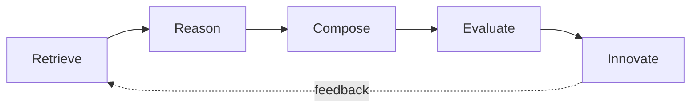

# The APIE Brain

The innovation engine is a reasoning protocol — the way all APIE knowledge gets turned into new product concepts. It is not a prompt; it is an **executable process** any AI agent (or human team) can run.

## Stage 1 — Retrieve

**Input:** a problem or product brief.
**Action:** pull from `datasets/*.json` — relevant products, patterns, features, flows, cross-domain transfers. Also scan `datasets/raw/` for fresh signals.
**Output:** a context pack: the pattern candidates with their evidence.
**Rule:** no empty reasoning — every claim in the pack cites a product ID or pattern ID.

## Stage 2 — Reason

**Input:** context pack + problem.
**Action:** decompose the problem into its parts (who, what job, what constraint, what metric); map each part onto patterns. Identify which pattern is the *engine* and which are *supporting*.
**Output:** a problem-pattern map.

## Stage 3 — Compose

**Input:** problem-pattern map.
**Action:** combine patterns — especially across domains. This is where cross-domain files earn their keep: Netflix's recommendation loop + Spotify's Wrapped + Robinhood's gamified onboarding = a new product concept.
**Output:** 10–30 product concepts, each naming its source patterns.

## Stage 4 — Evaluate

**Input:** concepts.
**Action:** score each on five axes, 1–5, with reasons:

| Axis | Question |
| --- | --- |
| User value | Does it solve a real, frequent, painful job? |
| Feasibility | Can it be built with today's tech and data? |
| Moat | Does it get harder to copy over time? |
| Timing | Is now the moment (regulatory, model capability, behavior)? |
| Risk | Regulatory, trust, ethical, unit-economics exposure |

**Output:** ranked concepts with scores and kill criteria.

## Stage 5 — Innovate

**Input:** top-ranked concepts.
**Action:** write the product concept: target user, core loop, the one metric, the pattern stack, the first 90-day build. Every element traces back to a repository source.
**Output:** `examples/Innovation-<Concept>.md` or an IC-ready memo.

## Worked Trace

The [Spotify × Robinhood innovation challenge](../examples/Innovation-Challenge-Spotify-x-Robinhood.md) is the engine's output for one pairing — 20 ideas, each naming its source patterns.

## Brain Rules

1. **Compose, don't generate.** Ideas without source patterns are discarded.
2. **Provenance everywhere.** Every output element cites product/pattern IDs.
3. **Evaluate honestly.** Kill weak ideas loudly; the evaluation axes are not optional.
4. **Feedback.** Failed concepts become pattern updates (pitfalls) — the brain learns by writing files.

